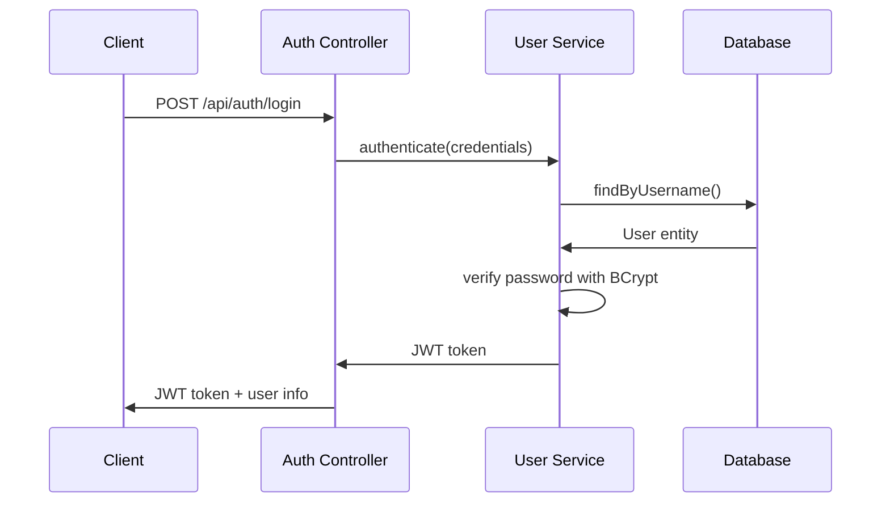
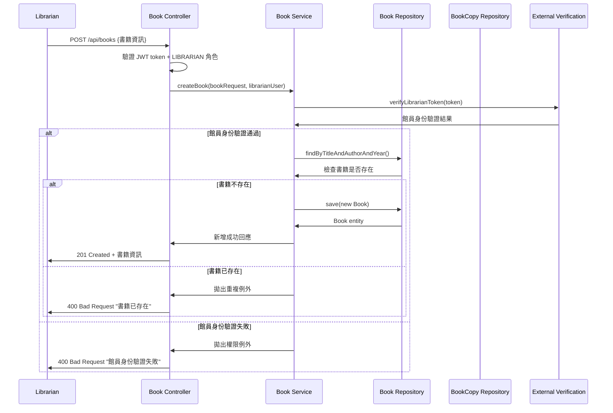
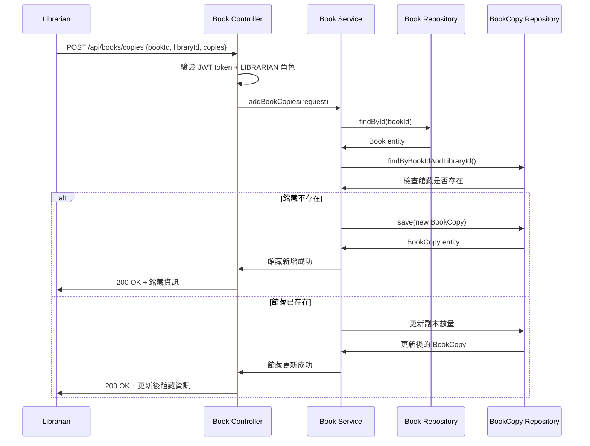
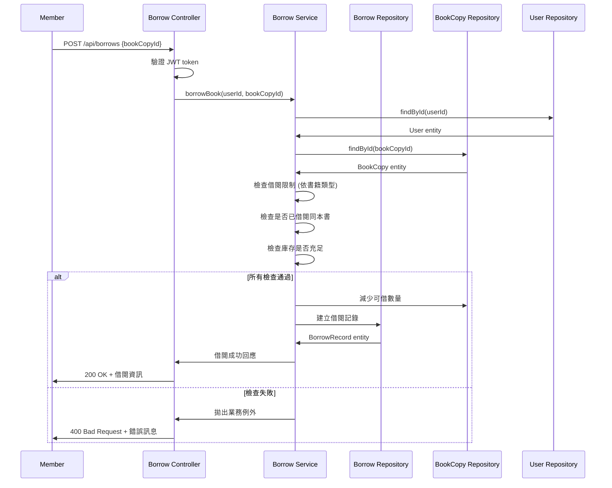
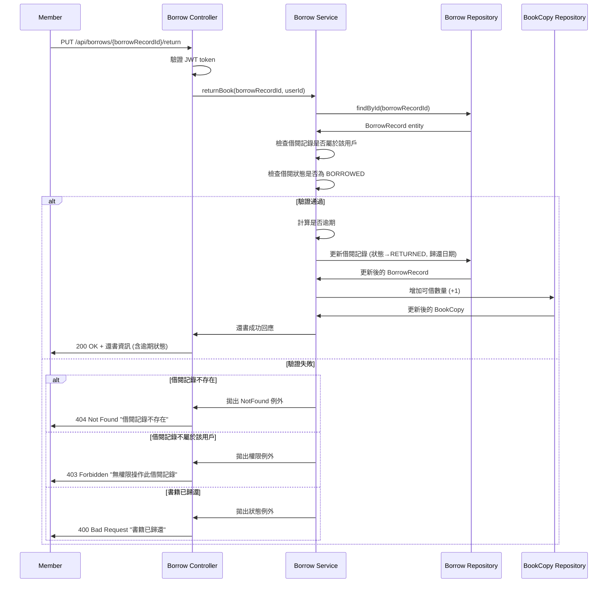

# 系統架構設計

## 概述

線上圖書借閱系統採用分層架構設計，並搭配 Claude Code AI 工具輔助程式開發。  
由本人負責系統設計與程式碼審查，確保程式品質、可擴展性、可維護性與可測試性。

## 技術選型

### 核心框架
- **Java 17**: LTS 版本，提供現代語言特性
- **Spring Boot 3.1.4**: 簡化配置，快速開發
- **Spring Data JPA**: 資料持久化抽象層
- **Spring Security**: 認證與授權
- **Lombok**: 減少樣板程式碼

### 資料庫
- **H2**: 輕量級嵌入式資料庫，Spring Boot 原生支援
- **H2 Console**: 內建網頁管理界面

### 測試框架
- **JUnit 5**: 單元測試框架
- **Mockito**: Mock 框架
- **Spring Boot Test**: 整合測試

## 系統架構

### 分層架構

```
┌─────────────────────┐
│   Presentation      │  Controller Layer (REST API)
├─────────────────────┤
│   Application       │  Service Layer (Business Logic)
├─────────────────────┤
│   Domain            │  Entity Layer (Domain Models)
├─────────────────────┤
│   Infrastructure    │  Repository Layer (Data Access)
└─────────────────────┘
```

### 目錄結構

```
src/main/java/com/library/
├── controller/         # REST API 控制器
├── service/           # 業務邏輯服務
├── entity/            # JPA 實體
├── repository/        # 資料存取層
├── config/            # 系統配置
├── dto/               # 資料傳輸物件
├── exception/         # 自定義例外
└── util/              # 工具類別
```

## 核心領域模型

### 資料庫結構

#### User (用戶表)
```sql
CREATE TABLE users (
    id BIGINT PRIMARY KEY AUTO_INCREMENT,
    username VARCHAR(50) UNIQUE NOT NULL,
    email VARCHAR(100) UNIQUE NOT NULL,
    password VARCHAR(100) NOT NULL,
    full_name VARCHAR(50) NOT NULL,
    role ENUM('MEMBER', 'LIBRARIAN') NOT NULL,
    active BOOLEAN NOT NULL DEFAULT TRUE,
    created_at TIMESTAMP NOT NULL DEFAULT CURRENT_TIMESTAMP,
    updated_at TIMESTAMP NOT NULL DEFAULT CURRENT_TIMESTAMP ON UPDATE CURRENT_TIMESTAMP
);
```

#### Library (圖書館表)
```sql
CREATE TABLE libraries (
    id BIGINT PRIMARY KEY AUTO_INCREMENT,
    name VARCHAR(100) NOT NULL,
    address VARCHAR(200) NOT NULL,
    phone VARCHAR(20),
    active BOOLEAN NOT NULL DEFAULT TRUE,
    created_at TIMESTAMP NOT NULL DEFAULT CURRENT_TIMESTAMP,
    updated_at TIMESTAMP NOT NULL DEFAULT CURRENT_TIMESTAMP ON UPDATE CURRENT_TIMESTAMP
);
```

#### Book (書籍表)
```sql
CREATE TABLE books (
    id BIGINT PRIMARY KEY AUTO_INCREMENT,
    title VARCHAR(200) NOT NULL,
    author VARCHAR(100) NOT NULL,
    publish_year INTEGER NOT NULL,
    type ENUM('BOOK', 'MAGAZINE') NOT NULL,
    isbn VARCHAR(20),
    publisher VARCHAR(100),
    created_at TIMESTAMP NOT NULL DEFAULT CURRENT_TIMESTAMP,
    updated_at TIMESTAMP NOT NULL DEFAULT CURRENT_TIMESTAMP ON UPDATE CURRENT_TIMESTAMP
);
```

#### BookCopy (館藏表)
```sql
CREATE TABLE book_copies (
    id BIGINT PRIMARY KEY AUTO_INCREMENT,
    book_id BIGINT NOT NULL,
    library_id BIGINT NOT NULL,
    total_copies INTEGER NOT NULL,
    available_copies INTEGER NOT NULL,
    version BIGINT,  -- 樂觀鎖版本號，防止併發超借
    status ENUM('ACTIVE', 'INACTIVE', 'MAINTENANCE') NOT NULL,
    created_at TIMESTAMP NOT NULL DEFAULT CURRENT_TIMESTAMP,
    updated_at TIMESTAMP NOT NULL DEFAULT CURRENT_TIMESTAMP ON UPDATE CURRENT_TIMESTAMP,
    FOREIGN KEY (book_id) REFERENCES books(id),
    FOREIGN KEY (library_id) REFERENCES libraries(id)
);
```

#### BorrowRecord (借閱記錄表)
```sql
CREATE TABLE borrow_records (
    id BIGINT PRIMARY KEY AUTO_INCREMENT,
    user_id BIGINT NOT NULL,
    book_copy_id BIGINT NOT NULL,
    library_id BIGINT NOT NULL,
    borrow_date DATE NOT NULL,
    due_date DATE NOT NULL,
    return_date DATE,
    status ENUM('BORROWED', 'RETURNED', 'OVERDUE') NOT NULL,
    created_at TIMESTAMP NOT NULL DEFAULT CURRENT_TIMESTAMP,
    updated_at TIMESTAMP NOT NULL DEFAULT CURRENT_TIMESTAMP ON UPDATE CURRENT_TIMESTAMP,
    FOREIGN KEY (user_id) REFERENCES users(id),
    FOREIGN KEY (book_copy_id) REFERENCES book_copies(id),
    FOREIGN KEY (library_id) REFERENCES libraries(id)
);
```

### 業務規則

1. **用戶權限**
   - `MEMBER`: 可借閱、查詢書籍、查看個人借閱記錄
   - `LIBRARIAN`: 可管理書籍、新增館藏、查看所有借閱記錄、發送到期通知

2. **借閱限制**
   - 書籍：每人最多 10 本
   - 圖書：每人最多 5 本
   - 借閱期限：1 個月

3. **庫存管理**
   - 每個圖書館分別管理自己的館藏
   - 同一本書可在多個圖書館有不同數量的副本
   - 支援依圖書館搜尋書籍
   - 借閱記錄會記錄所屬圖書館

## 設計決策

### 1. BookCopy 實體設計

**決策**: 分離 `Book` 和 `BookCopy`

**理由**:
- 遵循正規化原則，避免資料重複
- 支援多館系統，每館獨立管理庫存
- 便於擴展（如書籍狀態管理、館際調撥等）

**替代方案**: 在 Book 中直接存放館別和數量
- **缺點**: 資料重複、搜尋複雜、維護困難

### 2. H2 vs SQLite

**決策**: 選擇 H2

**理由**:
- Spring Boot 原生支援，配置簡單
- 完整的 SQL 標準支援
- 優秀的併發處理能力
- 內建 H2 Console 管理界面
- 支援 HikariCP 連線池
- 適合 Web 應用開發

**SQLite 的問題**:
- 連線池相容性差
- 併發寫入限制
- Spring Boot 整合複雜

備註： 生產環境會選用 PostgreSQL 或 MySQL，擴展性更佳。

### 3. 認證機制

**決策**: JWT + BCrypt

**理由**:
- 無狀態認證，適合 REST API
- BCrypt 安全性高，適合密碼加密
- JWT 便於前後端分離

### 4. 併發控制策略

**決策**: JPA 樂觀鎖 (@Version)

**問題場景**: 防止書籍超借
```java
// 併發問題：兩個用戶同時借最後一本書
用戶A: 查詢 availableCopies = 1 ✓
用戶B: 查詢 availableCopies = 1 ✓  
用戶A: 設定 availableCopies = 0，借書成功
用戶B: 設定 availableCopies = 0，借書成功  // 💥 超借！
```

**解決方案選擇**:

| 方案 | 性能 | 複雜度 | 適用性 | 選擇 |
|-----|------|--------|--------|------|
| **樂觀鎖 @Version** | ⭐⭐⭐⭐ | ⭐⭐ | ✅ 圖書館低衝突場景 | ✅ |
| 悲觀鎖 JPA | ⭐⭐ | ⭐⭐⭐ | ❌ 高衝突場景適用 | ❌ |
| SELECT FOR UPDATE | ⭐⭐ | ⭐⭐⭐ | ❌ 阻塞等待體驗差 | ❌ |
| 原子操作 SQL | ⭐⭐⭐⭐⭐ | ⭐ | ❌ 複雜業務邏輯不適用 | ❌ |

**選擇樂觀鎖的理由**:
1. **低衝突頻率**: 圖書館借書不是高頻搶購，同時借同一本書的機率低
2. **非阻塞性能**: 不會因為一個用戶操作而阻塞其他用戶
3. **用戶體驗**: 衝突時提供重試機制，避免長時間等待
4. **實作簡單**: Spring JPA 原生支援，維護成本低
5. **無死鎖風險**: 相比悲觀鎖，完全避免死鎖問題

**實作機制**:
```java
@Entity
public class BookCopy {
    @Version
    private Long version;  // JPA 自動管理版本號
    
    // 每次更新會自動檢查並遞增版本號
    // 如果版本號不匹配，拋出 OptimisticLockingFailureException
}

@Service
@Transactional
public class BorrowService {
    public BorrowBookResponse borrowBook(BorrowBookRequest request, User user) {
        try {
            return performBorrowing(request, user);
        } catch (OptimisticLockingFailureException e) {
            // 轉換為業務友善的錯誤訊息
            throw new BookNotAvailableException("書籍借閱失敗，其他用戶同時在借閱此書，請重試");
        }
    }
}
```

**事務保護**:
- 使用 `@Transactional` 確保借書操作的原子性
- 任何步驟失敗都會回滾整個事務，保證數據一致性
- 樂觀鎖衝突會觸發整個事務回滾

**測試驗證**:
- 單元測試：模擬 OptimisticLockingFailureException
- 整合測試：使用 CompletableFuture 測試真實併發場景
- 版本號測試：驗證 @Version 機制正常運作

**認證流程**:


## 核心業務流程

### 館員新增書籍流程



### 館員新增館藏流程



### 借書流程



### 還書流程



## 安全設計

### 授權策略

- **端點級別**: 使用 Spring Security 註解
- **方法級別**: `@PreAuthorize` 檢查角色權限
- **資料級別**: Service 層檢查資源擁有權

## 效能考量

### 資料庫最佳化

1. **H2 索引策略**
   ```sql
   -- H2 自動為主鍵和唯一約束建立索引
   CREATE INDEX idx_user_username ON users(username);
   CREATE INDEX idx_book_title ON books(title);
   CREATE INDEX idx_borrow_user_status ON borrow_records(user_id, status);
   CREATE INDEX idx_bookcopy_book_library ON book_copies(book_id, library_id);
   ```

2. **查詢最佳化**
   - 使用 JPA 投影避免 N+1 查詢
   - 適當使用 `@BatchSize` 註解
   - H2 支援完整 SQL 語法，關鍵查詢可使用原生 SQL

3. **H2 特定配置**
   - 檔案模式：`jdbc:h2:file:./data/library`
   - 記憶體模式：`jdbc:h2:mem:library`（測試用）
   - H2 Console：開發時的管理界面

4. **快取策略**
   - 書籍資訊使用 `@Cacheable`
   - 用戶權限資訊快取

### 併發性能

1. **樂觀鎖效能特點**
   - **讀取性能**: 無鎖開銷，多用戶可同時讀取
   - **寫入性能**: 僅在更新時檢查版本號，開銷極小
   - **衝突處理**: 快速失敗，避免長時間阻塞
   - **記憶體使用**: 版本號佔用 8 bytes，影響微乎其微

2. **事務設計**
   - 保持事務短小，減少樂觀鎖衝突視窗
   - 避免在事務中進行長時間操作（如外部 API 調用）
   - 使用 `@Transactional(readOnly = true)` 優化唯讀操作

3. **衝突率監控**
   ```java
   // 可加入監控指標
   @EventListener
   public void handleOptimisticLockFailure(OptimisticLockingFailureException e) {
       metricsService.incrementCounter("optimistic_lock_conflicts");
   }
   ```

4. **效能指標**
   - 樂觀鎖衝突率 < 1%（預期）
   - 平均借書響應時間 < 200ms
   - 併發借書處理能力 > 100 TPS

## 測試策略

### 測試金字塔

```
    ┌─────────────┐
    │     E2E     │  少量，覆蓋關鍵流程
    ├─────────────┤
    │ Integration │  中等，測試組件間互動
    ├─────────────┤
    │    Unit     │  大量，測試業務邏輯
    └─────────────┘
```

### 測試分類

1. **單元測試** (80%)
   - Service 層業務邏輯
   - Repository 層資料存取
   - Utility 方法

2. **整合測試** (15%)
   - Controller 層 API 測試
   - 資料庫操作測試

3. **端到端測試** (5%)
   - 完整用戶流程測試

## 部署架構

### 開發環境
```
┌─────────────┐
│ Spring Boot │
│   (8080)    │
├─────────────┤
│ H2 Database │
│ + H2 Console│
│ (./data/)   │
└─────────────┘
```

## 監控與維運

### 應用監控
- Spring Boot Actuator
- Micrometer metrics
- 自定義健康檢查端點

### 日誌策略
- 結構化日誌 (JSON format)
- 分級記錄 (ERROR, WARN, INFO, DEBUG)
- 敏感資訊遮罩

### 備份策略
- H2 資料庫檔案定期備份
- 定期匯出 SQL 腳本
- 災難恢復計畫

## 技術債務

### 當前限制
1. H2 僅適合開發環境
2. 單體架構擴展性限制
3. 缺乏分散式快取

### 改善計畫
1. 生產環境遷移至 PostgreSQL/MySQL
2. 準備微服務拆分方案
3. 引入 Redis 快取層